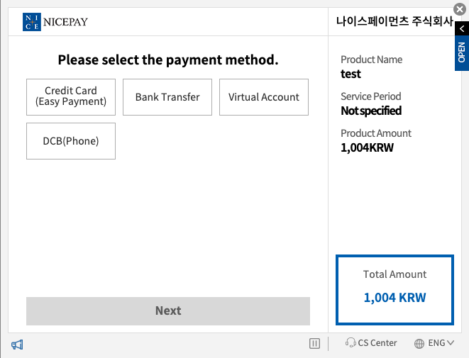

<div align="right">
  
</div>
<h3 align="center">
  🚀 NicePay For Startups
</h3>

<!-- https://github.com/denvercoder1/readme-typing-svg -->
<p align="center">
  
</p>
                           
<br>


### Information 
This is a common guide needed before development.  
[Client and Secret key](./info/nicepay-info-key.md) | [Firewall and Timeout](./info/nicepay-info-firewall-timeout.md) | [Basic and Bearer authentication](./info/nicepay-info-basic-token.md) | [Support environment](./info/nicepay-info-general.md) | [Sandbox](./info/nicepay-info-sandbox.md) | 
  
### API
This is a technical document that includes information about the API.  
[List of API](./api/nicepay-api-uri-list.md) | [Payment](./api/nicepay-api-payment-window-url.md) | [Recurring Payment](./api/nicepay-api-billing.md) | [Access token](./api/nicepay-api-access-token.md) | [Transaction Status Inquiry](./api/nicepay-api-retrieve.md) | [Cancel](./api/nicepay-api-cancel.md) | [Reconciliation](./api/nicepay-api-reconciliation.md) |  [Webhook](./api/nicepay-api-webhook.md) |

<div align="left"> 
 <a href="https://github.com/nicepayments/nicepay-node">
  
 </a>
 <a href="https://github.com/nicepayments/nicepay-python">
   
 </a>
 <a href="https://github.com/nicepayments/nicepay-ruby">
  
 </a> 
 <a href="https://github.com/nicepayments/nicepay-asp">
  
 </a>
 <a href="https://github.com/nicepayments/nicepay-java">
  
 </a>  
 <a href="https://github.com/nicepayments/nicepay-php">
  
 </a>
 <a href="https://github.com/nicepayments/nicepay-dotnet">
  
 </a>  
</div>
👉 When you click on the development language, you can check the source code.  

<br>

### CODE
These are response and error codes.  
[HTTP status code](./code/nicepay-code.md#HTTP-status-code) | [Card-code](./code/nicepay-code.md#Card-code) | [Bank-code](./code/nicepay-code.md#Bank-code) | [API Response code](./code/nicepay-code.md#API-response-code) |

<br><br>

## ⚡ Quick guide

### Getting Started

This is a ⚡ Quick guide for development.  
By following the guide in order, it is possible to develop a Checkout TEST in about ⏱️ 10 minutes.  

<br>

> #### ⚠️ Important  
> If you are conducting a test in a network environment with IP restrictions, firewall configuration may be necessary to make API calls.  
>  👉 [Firewall and Timeout](./info/nicepay-info-firewall-timeout.md)

<br>

### Over-view

  

If a customer send an order, please call the Checkout creation API first.   
After that, the customer can proceed with payment by accessing the URL that is returned in the response.  

<br>  

> #### ⚠️ Important  
> The Sandbox and Live domains may be different.   
> Once testing is complete, be sure to switch to the Live domain.   

<br><br>

### Create a checkout example code

- If the Create Checkout API call is successful, it will respond with a URL.
- Please refer to the [link](./api/nicepay-api-payment-window-url.md) for the request parameters of the Create Checkout API.

```bash
curl --location 'https://api.nicepay.co.kr/v1/checkout' \
--header 'Content-Type: application/json' \
--header 'Authorization: Basic UjFfOTRlYjN...' \
--data '{
    "method": "cardAndEasyPay",
    "sessionId" : "unique-sessionId-001",
    "clientId": "R1_94eb3a4a30264fdba82ce0d05b465012",
    "orderId": "order-id-unique-order-001",
    "amount": 1004,
    "goodsName" : "test",
    "returnUrl": "http://your-return-url.com",
    "language" : "EN"
}'
```

### Create a checkout example response

```bash
{
    "resultCode": "0000",
    "resultMsg": "정상 처리되었습니다.",
    "sessionId": "unique-sessionId-001",
    "orderId": "order-id-unique-order-001",
    "clientId": "R1_94eb3a4a30264fdba82ce0d05b465012",
    "tid": null,
    "amount": 1004,
    "goodsName": "test",
    "returnUrl": "http://your-return-url.com",
    "apprStatus": "ready",
    "skinType": null,
    "taxFreeAmt": null,
    "isExpire": false,
    "updateDate": null,
    "expireDate": "2023-03-25T13:58:01.000+0900",
    "mallReserved": null,
    "mallUserId": null,
    "buyerName": null,
    "buyerTel": null,
    "buyerEmail": null,
    "useEscrow": false,
    "currency": "KRW",
    "logoImgUrl": null,
    "language": "EN",
    "returnCharSet": null,
    "cardQuota": null,
    "cardCode": null,
    "cardShowOpt": null,
    "vbankHolder": null,
    "vbankValidHours": null,
    "vbankExpDate": null,
    "isDigital": false,
    "directReceiptType": null,
    "directReceiptNo": null,
    "disableScroll": false,
    "disableEdgeChk": false,
    "appScheme": null,
    "method": "cardAndEasyPay",
    "url": "https://pay.nicepay.co.kr/v1/checkout/pay/unique-sessionId-001",
    "zidxHigher": false
}
```

When you access the URL that was responded, the Checkout window will be displayed, and the client will be able to make a payment.

<br><br>



https://pay.nicepay.co.kr/v1/checkout/pay/unique-sessionId-001

<br><br>

### Payment (Approval) response example

- When the client completes the payment, the approval information will be sent to the endpoint of the `returnUrl`

- Refer to the [Code](./code/nicepay-code.md) for the response and error codes. 

```bash
POST
Content-type: application/json
```
```bash
{
    "resultCode": "0000",
    "resultMsg": "정상 처리되었습니다.",
    "tid": "yeoshin01m01012303241404031098",
    "cancelledTid": null,
    "orderId": "order-id-unique-order-001",
    "ediDate": "2023-03-24T14:04:16.982+0900",
    "signature": "59a05ad89bbbb6b5dda157dd31c48510f78eefdffc13ebec94f5afffa067fa4f",
    "status": "paid",
    "paidAt": "2023-03-24T14:04:03.000+0900",
    "failedAt": "0",
    "cancelledAt": "0",
    "payMethod": "card",
    "amount": 1004,
    "balanceAmt": 1004,
    "goodsName": "test",
    "mallReserved": null,
    "useEscrow": false,
    "currency": "KRW",
    "channel": "pc",
    "approveNo": null,
    "buyerName": null,
    "buyerTel": null,
    "buyerEmail": "test@abc.com",
    "receiptUrl": "https://npg.nicepay.co.kr/issue/IssueLoader.do?type=0&innerWin=Y&TID=yeoshin01m01012303241404031098",
    "mallUserId": null,
    "issuedCashReceipt": false,
    "coupon": null,
    "card": {
        "cardCode": "07",
        "cardName": "현대",
        "cardNum": "624368******7607",
        "cardQuota": 0,
        "isInterestFree": false,
        "cardType": "credit",
        "canPartCancel": true,
        "acquCardCode": "07",
        "acquCardName": "현대"
    },
    "vbank": null,
    "bank": null,
    "cellphone": null,
    "cancels": null,
    "cashReceipts": null,
    "sessionId": "unique-sessionId-001"
}
```
> #### ⚠️ Important  
> When conducting tests through the Sandbox, actual approvals will not occur.  
> Also, arbitrary values are returned in the response.  
<br>