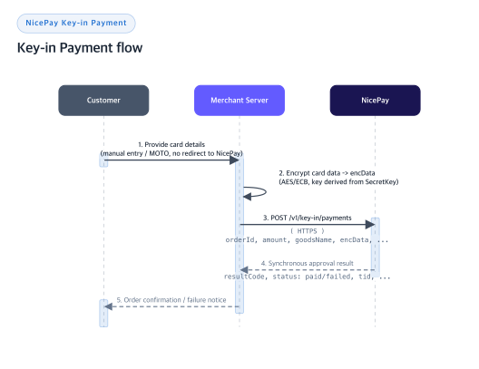

## Key-in Payment

Key-in (Manual Entry) payment lets you submit a card charge directly with card details you already hold (MOTO / manually entered card), without redirecting the customer through the Hosted Payment Page. You encrypt the card data server-side (the encryption key is derived from your SecretKey, which must never leave your server) and call this API directly; NicePay returns the final approval result synchronously in the response; there is no separate authorization callback.

> **⚠️ Important:** Key-in is only available to merchants that NicePay has enabled for manual-entry payments. Without that, the call fails with [`U313`](../code/nicepay-code.md#code-u313) or [`A128`](../code/nicepay-code.md#code-a128) (`Not a key-in merchant`).  
> NicePay sets which card holder details `encData` must carry for your merchant account, see [encData Field Details](#encdata-field-details) below. You cannot choose them per request.  
> Key-in Payment is not provided in [Sandbox](../info/nicepay-info-sandbox.md#base-url-information-for-sandbox-and-live); you can only test it against Live once your merchant account is enabled for manual-entry payments.  

<br>

**Before you start**, you'll need:
- A [Client and Secret key](../info/nicepay-info-key.md) issued from the NicePay admin console
- An `Authorization` header built from those keys, see [Basic and Bearer authentication](../info/nicepay-info-basic-token.md)
- This API has no Sandbox, see the note above; test against Live directly. A Live test charges a real card: cancel each test payment afterwards with [Cancel request with tid](./nicepay-api-cancel.md#cancel-request-parameter-with-tid)
- Your server will handle raw card numbers directly. See [PCI-DSS Overview](../info/nicepay-info-pci-dss.md) for what that generally implies, and confirm the specific requirements for your account with NicePay

<br>

### Over-view
<a href="../image/payment-keyin.svg"></a>

<br>

### Example code

```bash
curl -X POST 'https://api.nicepay.co.kr/v1/key-in/payments' \
-H 'Content-Type: application/json' \
-H 'Authorization: Basic <credentials>' \
-d '{
    "orderId": "merchant-order-id",
    "amount": 1004,
    "goodsName": "test",
    "encData": "7c4b12eb43324290bd0e522900a892343f57e0d176cdadae757132c7f3cd442f023ef5c3ffa254ed04b6d47624d4c7847e8061f3be0d67adf1b463b46a542052cf47a5206bfd23945fc1851d426468f4",
    "isInterestFree": false,
    "cardQuota": 0
}'
```

> `encData` here is encrypted with AES-128 in ECB mode, with the first 16 characters of your SecretKey as the key and no IV (see [encData Field Encryption Example](#encdata-field-encryption-example) below). [Recurring Payment](./nicepay-api-billing.md#encdata-field-encryption-example-aes-128) uses the same encryption when you send no `encMode`.

<br>

### Key-in Payment Request Parameter

```bash
POST /v1/key-in/payments HTTP/1.1
Host: api.nicepay.co.kr
Authorization: Basic <credentials> or Bearer <token>
Content-type: application/json;charset=utf-8
```

Required: Yes = always send; No = optional; Conditional = send in the case stated in Description.

| Parameter | Type | Required | Bytes | Description |
|:--------------|:---------:|:----------:|:-------:|:--------------|
| `orderId` | String | Yes | 64 | Your unique order id<br> cannot reuse the orderid |
| `amount` | Int | Yes | 12 | Transaction amount<br>Whole number with no decimal point. See [Amounts and currencies](../info/nicepay-info-general.md#amounts-and-currencies) |
| `goodsName` | String | Yes | 40 | Product Name |
| `encData` | String | Yes | 512 | Card information encryption data<br>See [encData Field Details](#encdata-field-details) below |
| `isInterestFree` | Boolean | Yes | 5 | true: the merchant pays the customer's installment interest / false: general |
| `cardQuota` | Int | Yes | 2 | Installment period<br>0: pay in full, 2: 2 months, 3: 3 months … |
| `ediDate` | String | Conditional | 40 | Request timestamp (ISO 8601) that your Merchant Server creates, see [Dates in requests](../info/nicepay-info-general.md#dates-in-requests)<br>Required when you send `signData` |
| `signData` | String | No | 256 | Forgery verification data<br>Rule: hex(sha256(orderId + ediDate + SecretKey)) |
| `buyerName` | String | No | 30 | Buyer name |
| `buyerEmail` | String | No | 60 | Buyer email |
| `buyerTel` | String | No | 40 | Buyer phone number (number only) |
| `taxFreeAmt` | Int | No | 12 | Tax-free part of `amount`<br>Whole number with no decimal point, not greater than `amount`: a larger value fails with [`U321`](../code/nicepay-code.md#code-u321). See [Tax breakdown](../info/nicepay-info-general.md#tax-breakdown) |
| `supplyAmt` | Int | No | 12 | Supply amount, the pre-VAT portion of `amount`<br>Ignored on this API: NicePay computes it from `amount` and `taxFreeAmt`, see the note below |
| `goodsVat` | Int | No | 12 | VAT portion of `amount`<br>Ignored on this API, see the note below |
| `serviceAmt` | Int | No | 12 | Service charge portion of `amount`<br>Ignored on this API, see the note below |
| `currency` | String | No | 3 | Currency of `amount`<br>`KRW`: Korean won / `USD`: US dollar / `CNY`: Chinese yuan<br>Upper case only. There is no default: send `KRW` for a payment in won. See [Amounts and currencies](../info/nicepay-info-general.md#amounts-and-currencies) |
| `returnCharSet` | String | No | 10 | `utf-8` (default) or `euc-kr`<br>Sets the charset in the `Content-Type` header of the response. Keep `utf-8` |
| `mallReserved` | String | No | 500 | Reserved field for the merchant<br>We recommend using it in JSON string format.<br>Double quotation mark (") cannot be used. |

> **⚠️ Important:** On this API, NicePay ignores the `supplyAmt`, `goodsVat` and `serviceAmt` that you send. NicePay computes them from `amount` and `taxFreeAmt` (0 when you leave it out), so the four values always add up to `amount`. To change the tax split, send `taxFreeAmt`. See [Tax breakdown](../info/nicepay-info-general.md#tax-breakdown) for the formula.  

<br>

### encData Field Details

`encData` always carries `cardNo`, `expYear` and `expMonth`. NicePay sets which additional fields it must also carry for your merchant account: none, `cardPw`, `idNo`, or both `idNo` and `cardPw`. When your account requires none, NicePay ignores `idNo` and `cardPw` even if you include them.

> **⚠️ Important:** NicePay checks only the fields that `encData` contains. When your account requires additional fields, a field other than `cardNo`, `expYear`, `expMonth` and the additional fields of your account fails the request with `U341`, for example `idNo` when your account requires only `cardPw`. An empty `cardNo`, `expYear` or `expMonth`, or an empty additional field of your account, also fails with `U341`. NicePay does not reject a missing field: the payment goes ahead without it. Always include the additional fields of your account.  
> NicePay does not return this setting through the API. [Open an issue on this manual's repository](https://github.com/SeokRae/nicepay-manual-eng/issues) if you are not sure which additional fields your account requires.  

| Parameter | Type | Required | Bytes | Description |
|:--------------|:---------:|:----------:|:-------:|:--------------|
| `cardNo` | String | Yes | 16 | Card number, numbers only |
| `expYear` | String | Yes | 2 | Expiration year, format: YY |
| `expMonth` | String | Yes | 2 | Expiration month, format: MM |
| `idNo` | String | Conditional | 13 | Card holder's date of birth, 6 digits: YYMMDD (for example `800101` for 1 January 1980)<br>Corporate card: Korean business registration number, 10 digits<br>Required when NicePay has set your merchant account to require `idNo` |
| `cardPw` | String | Conditional | 2 | First 2 digits of the 4-digit card password of a Korean card<br>Required when NicePay has set your merchant account to require `cardPw` |

In the plain text, put `expMonth` directly after `expYear`, as in the example below. Another order can corrupt the card number or the expiration date. The example contains both `idNo` and `cardPw`: leave out the fields that your merchant account does not require. For overseas-issued cards, see [Accepting overseas customers](../info/nicepay-info-general.md#accepting-overseas-customers).

<br>

### encData Field Encryption Example

Key-in's `encData` is encrypted with **AES-128 in ECB mode**, so there is no IV. It is the same encryption as the default of [Recurring Payment](./nicepay-api-billing.md#encdata-field-encryption-example-aes-128), and the two examples give the same `encData`.

```bash
- Encryption Algorithm : AES128
- Encryption Details   : AES/ECB/PKCS5Padding
- Encoding             : Hex Encoding
- Encryption KEY       : the first 16 characters of the SecretKey (ECB mode does not use an IV)

- Plain-text     : cardNo=1234567890123456&expYear=25&expMonth=12&idNo=800101&cardPw=12
- Encryption-key : 2dcc2a0d63bf4694 (the first 16 characters of the SecretKey)

- Encrypted-text : `7c4b12eb43324290bd0e522900a892343f57e0d176cdadae757132c7f3cd442f023ef5c3ffa254ed04b6d47624d4c7847e8061f3be0d67adf1b463b46a542052cf47a5206bfd23945fc1851d426468f4`
```

<br>

### Key-in Payment Response Parameter

```bash
Content-type: application/json
```

Dates and times that NicePay returns are in Korea Standard Time (KST, UTC+9), for example `2023-03-24T14:04:16.982+0900`. See [Dates in responses](../info/nicepay-info-general.md#dates-in-responses) for how to parse them.

Required: Yes = has a non-empty value in every response whose `resultCode` is `0000`; No = can be `null`, empty, or left out. For a field of an object or array, Yes applies whenever that object or array element is present.

| Parameter | Type | Required | Bytes | Description |
|:----------|:----:|:--------:|:------:|:-----------|
| `resultCode` | String | Yes | 4 | 0000 : success / other failure |
| `resultMsg` | String | Yes | 100 | Result message |
| `tid` | String | Yes | 30 | NICEPAY transaction ID |
| `orderId` | String | Yes | 64 | Your unique order ID |
| `amount` | Int | Yes | 12 | payment amount |
| `currency` | String | No | 3 | The `currency` of the request, returned as sent<br>`null` when the request had no `currency` |
| `goodsName` | String | Yes | 40 | Product name |
| `status` | String | Yes | 20 | Payment processing status<br>paid: payment completed<br>failed: payment failed<br>['paid', 'failed'] |
| `paidAt` | String | Yes | - | Time of payment completed, ISO 8601 format<br>If payment is not completed, return 0 |
| `failedAt` | String | Yes | - | Time of payment failure, ISO 8601 format<br>If not a payment failure, return 0 |
| `ediDate` | String | Yes | - | Response message creation date and time, ISO 8601 format |
| `signature` | String | Yes | 256 | Forgery verification data<br>Rule: hex(sha256(tid + amount + ediDate + SecretKey)) |
| `approveNo` | String | No | 30 | Authorization number |
| `buyerName` | String | No | 30 | Buyer name |
| `buyerTel` | String | No | 40 | Buyer phone number |
| `buyerEmail` | String | No | 60 | Buyer email |
| `receiptUrl` | String | No | 200 | Receipt URL |
| `mallReserved` | String | No | 500 | Reserved field for the merchant |
| `card` | Object | Yes | | Credit card object, see [Card information](#card-information-) below |
| `messageSource` | String | Yes | | nicepay: Response message generated by nicepay<br>external: Response message generated by 3rd partner |

<br>

#### Card information 

Same fields and rules as [Card information](./nicepay-api-retrieve.md#card-information--) in Transaction Status Inquiry.

| Parameter | Field | Type | Required | Bytes | Description |
|:----------|:----------|:--------:|:-----:|:-------:|:--------------|
| `card` | | Object | Yes | | Credit card object |
| | `cardCode` | String | Yes | 3 | Card company code, see [Card code](../code/nicepay-code.md#card-code) |
| | `cardName` | String | Yes | 20 | Card company name, in Korean whatever the `language` of the request, for example `삼성` |
| | `cardNum` | String | No | 20 | Card number, masked: for a card number of 13 digits or more, the first 6 and the last 4 digits are shown and the digits between them are replaced with `*`<br>Ex) `123412******1234`<br>- Kakao Money/Naver Point/Payco Point used for payment 'null' will be return. |
| | `cardQuota` | Int | Yes | 3 | Installment Month<br>0: lump sum, 2:2 months, 3:3 months … |
| | `isInterestFree` | Boolean | No | - | The store pays the customer's installment interest<br>true: yes, false: no, null: not reported for this payment |
| | `cardType` | String | No | 6 | Card type<br>credit:credit card, check:debit |
| | `canPartCancel` | Boolean | No | - | Whether partial cancellation is possible<br>true: Possible, false: Impossible, null: not reported by the acquirer for this card |
| | `acquCardCode` | String | Yes | 3 | Acquirer code, see [Card code](../code/nicepay-code.md#card-code) |
| | `acquCardName` | String | Yes | 100 | Acquirer name, in Korean |

<br>

### After a Key-in payment

- Key-in does not have its own cancel API. Cancel or refund with the standard [Cancel request with tid](./nicepay-api-cancel.md#cancel-request-parameter-with-tid).
- You can look up a Key-in transaction anytime via [Transaction Status Inquiry](./nicepay-api-retrieve.md#transaction-status-inquiry-with-tidtransaction-id) with the `tid`.
- If the Key-in call times out, look the payment up by `orderId` as described in [Timeout Information](../info/nicepay-info-firewall-timeout.md#timeout-information).
- Related error codes: `A128`, `U313`, `U340`, `U341`, see [API Response code](../code/nicepay-code.md#api-response-code).
